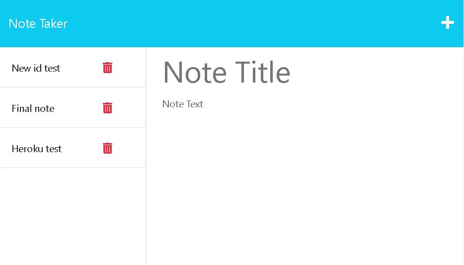

# Note Taker App

## Description

This is a simple note taker app that I made with express.js! This app was made to help myself and other users remember tasks by writing and saving notes with this app. While making this project, I learned how to use express.js to set up a server, make routes that bring in different html files, and set up api routes for fetch requests.

## Table of Contents

[Installation](##installation)
[Usage](##usage)
[License](##license)
[Contributing](##contributing)
[Tests](##tests)
[Questions](##questions)

## Installation

N/a

## Usage 

To find this app, click [here](https://guarded-dawn-27731-ee7ac0414d3b.herokuapp.com/) to use the app on heroku.

To use this app, click the plus icon in the top right to write a new note. Once you write a new note, click on the save button icon in the top right. Your note will now be saved to the list on the left. To view old notes, you can click on them from the list.

## Contributing

For this project, I looked back at the module 11 mini-project to use some of their utility functions. I also rewatched Trey make the mini project in order to help me make this app. I used the 'uuid' npm package: https://www.npmjs.com/package/uuid Lastly, I also watched this youtube video to help with express.js https://youtu.be/L72fhGm1tfE?si=5VEkVHMWOv0tHj2E (Express.js crash course from traversy media)

## Tests

N/A

## Questions

This is the name of my Github profile; BreePrimmer. 
Here is the link to my GitHub; [github link](https://github.com/BreePrimmer)

If you would like to reach out to me for any questions, you can communicate with me via my email, breempri@gmail.com
